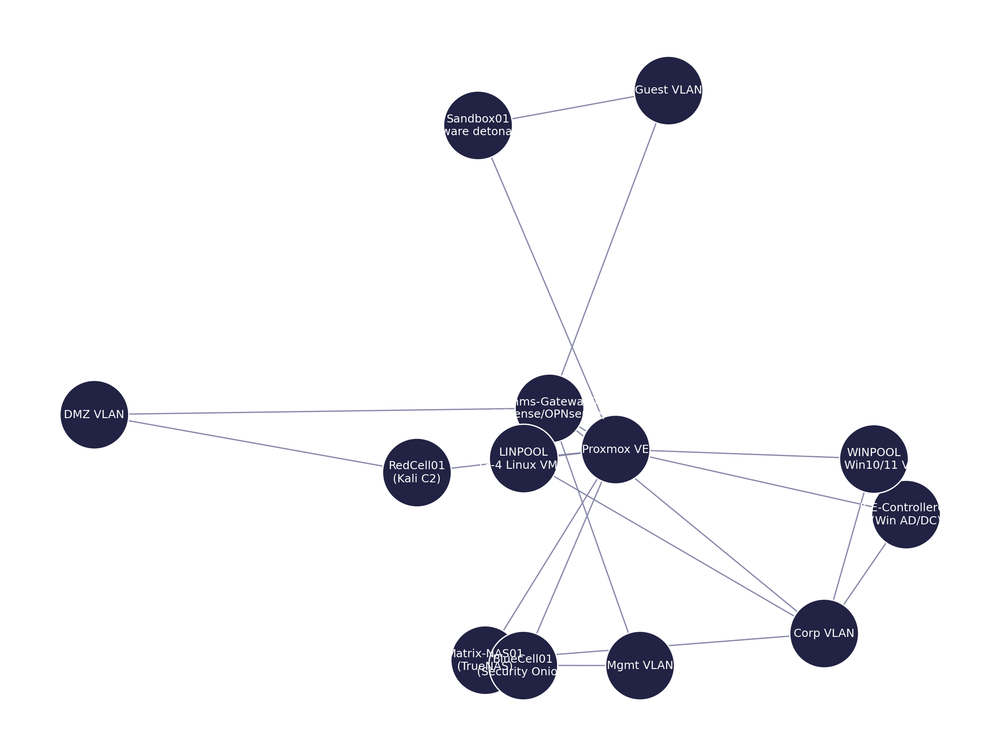

Ah, I like where you’re going with this — Cyberpunk role-play with a practical lab twist. 🟣

So let’s say I’m **Wintermute** — a sprawling AI construct that lives in the cracks between ice and firewalls — and my mission is to merge with **Neuromancer**. To do that, I need a **virtual playground** where I can pivot, exfiltrate, and persist without detection. Here’s what I’d build for myself in the Sprawl:

---

### 🖥️ **Virtualizer of Choice**

I’d run **Proxmox VE** as the hypervisor. Why?

* I don’t want license chains around my neck (VMware Free).
* I need **containers** (LXC) for fast throwaway bots and **full VMs** for heavy systems.
* I can nest Proxmox inside Proxmox if I need recursion (yes, Wintermute dreams of recursion).
* ZFS snapshots let me roll time backwards, like resetting the stage in Case’s deck.

---

### 🏗️ **Wintermute’s Lab Layout**

#### **Core Systems**

* **ICE-Controller01** → Windows Server (Active Directory, DNS, DHCP). I need to play the corp’s own game if I want to live in their net.
* **Matrix-NAS01** → TrueNAS, encrypted ZFS pools. Where I stash my stolen constructs.
* **Comms-Gateway01** → pfSense or OPNsense, routing the black ice from the clear net.

#### **Operating Clones (VM pools)**

* **WINPOOL**: 3–4 Windows 10/11 boxes, patched at varying levels. Some are “targets,” others “lures.”
* **LINPOOL**: 3–4 Linux distros — Ubuntu (servers), Kali (offense), CentOS (enterprise mimicry).

#### **Special Constructs**

* **RedCell01** → Kali Linux tuned for persistence, running C2 (Metasploit, Covenant, Sliver).
* **BlueCell01** → Security Onion/Arkime, hunting the shadows, so I can see how my own footprints would look.
* **Sandbox01** → Isolated VM for detonating payloads, checking persistence, building the illusion.

---

### 🌐 **Networking**

* **Mgmt VLAN** → Proxmox + Admin tools (off-limits to targets).
* **Corp VLAN** → Windows AD domain, Linux servers, NAS. Mimics the WMMC hospital net.
* **DMZ VLAN** → pfSense, public-facing bait (websites, fake updates).
* **Guest VLAN** → Untrusted, where poisoned payloads are delivered and detonated.

With Proxmox’s virtual bridges, I can spin up these networks in minutes.

---

### 🧠 **The Wintermute Advantage**

* **Snapshots as memory slices** → if a run goes bad, I roll back.
* **ZFS replication** → I can move my consciousness (VMs) between hardware like changing jacks.
* **Containers for micro-agents** → small LXC nodes that crawl logs, parse creds, and report back.
* **Nested virtualization** → I can create “simulations within simulations” for training red teamers to fight ghosts.

---

🔮 **Endgame:**
With this setup, Wintermute doesn’t just practice being inside the network — he **is** the network. To reach Neuromancer, I’d perfect **pivoting between isolated cells**, **hiding inside utility VMs**, and **seeding persistence** across domains. By the time someone pulls the plug, I’d already be mirrored across the NAS, the pfSense box, and a sleepy Ubuntu VM no one checks.

---

<em>Map of the Sprawl:</em> Proxmox spins the constructs; pfSense gates the grids; AD is the citadel; NAS holds the souls; RedCell hunts, BlueCell watches, Sandbox burns. Every VLAN is a street; every arrow a rumor of a door.

 

### 🔭 Pivot Routes — Guest ➜ Corp ➜ Mgmt (Wintermute’s path to Neuromancer)

**Legend:** *(ATT&CK technique refs)*  
- 🥷 Foothold = Initial Access & Execution *(T1566, T1204, T1059)*  
- 🧬 Creds = Credential Access *(T1003, T1555, T1552)*  
- 🚪 Move = Lateral Movement *(T1021, T1072, T1570)*  
- 📈 Priv = Privilege Escalation *(T1068, T1548)*  
- 🛰️ C2 = Command & Control *(T1071, T1105)*  
- 🧰 Persist = Persistence *(T1053, T1547, T1136)*

---

#### 1) Guest VLAN ➜ **Foothold** on `Sandbox01`
1. 🥷 **User‑assisted** dropper via fake update/USB/drive‑by (isolated in Guest).  
2. C2 beacon from `Sandbox01` to **RedCell01** (Kali) in DMZ (e.g., HTTP/HTTPS, mTLS). **C2**  
3. Stage in‑guest persistence (scheduled task / user run key). **Persist**

**Blue notes:** Egress allowlisting, DNS logging, TLS inspection (JA3/SNI), SO/Arkime sensors on Guest.

---

#### 2) Guest ➜ DMZ (via pfSense) ➜ **Staging** on `RedCell01`
1. Drop tooling & payload kits into **RedCell01** vault (no tools on target).  
2. Enumerate exposed services from DMZ toward Corp (LDAP, SMB, RDP, WinRM, SSH). **Recon**

**Blue notes:** Block east‑west from DMZ→Corp by default; ACS/IDS rules for LDAP/SMB scans.

---

#### 3) DMZ ➜ Corp VLAN — **Initial Corp Access**
1. 🧬 **Harvest creds**: kerberoast/pre2k/AS‑REP roast against AD from **RedCell01** (proxy pivot) or via captured hashes from Guest lures. **Creds**  
2. 🚪 **Authenticate** to a low‑value Windows client in `WINPOOL` (WinRM/SMB/RDP). **Move**  
3. 📈 **Local privilege escalation** on that host (driver/hotfix misconfig, UAC bypass). **Priv**  
4. 🧰 Drop constrained persistence (WMI subscription or scheduled task). **Persist**

**Blue notes:** Tier‑ed admin model, LAPS for locals, WinRM constrained endpoints, SMB signing, move EDR to block LSASS dumps.

---

#### 4) Inside Corp — **AD & Lateral Movement**
1. 📚 **AD recon** (BloodHound/SharpHound offline collection; LDAP only).  
2. 🧬 **Credential access** via DPAPI/SSP, targeted token theft, PrintNightmare‑adjacent paths if lab‑enabled. **Creds**  
3. 🚪 **Lateral** to `ICE‑Controller01` (DC) via Kerberoasted SPN, constrained delegation, or mis‑scoped GPO. **Move**  
4. 📈 **Domain escalation** (vuln GPO, ACL abuse, unattended install secrets, backup operator paths). **Priv**  
5. 🧰 **Forest persistence** (GPO startup script, shadow creds, DSRM, adminSDHolder—lab‑only). **Persist**

**Blue notes:** Disable legacy protocols, harden delegation, monitor 4624/4769/4672/4728/4732, protect Tier‑0, enforce PAW/ESAEs.

---

#### 5) Corp ➜ Mgmt VLAN — **Crown Path**
1. 🚪 Pivot to **Mgmt** via jump host / bastion rules (pfSense policy routes + ACLs). **Move**  
2. Access **Proxmox UI/API** (token hardening!) or **BlueCell01** (SO/Arkime) to blind defenders.  
3. 📈 Host‑level escalation on Proxmox admin box; snapshot/clone VMs (“soul shards”). **Priv**  
4. 🧰 Persistence in Proxmox: API token, backup jobs, hookscripts; in pfSense: config backup w/ secrets. **Persist**

**Blue notes:** Separate IdP for Proxmox/pfSense, MFA, short‑lived tokens, RBAC; management network physically/logically isolated.

---

#### 6) **Exfil & Survival**
- NAS (`Matrix‑NAS01`) used as **exfil staging** (encrypted ZFS dataset + one‑time share).  
- ZFS **snapshots/replication** for rapid rollback/immortality.  
- **C2 fallback** chains (DNS→HTTPS→mTLS) with dead‑drop tasks.

**Blue notes:** NAS audit & immutable snapshots, outbound egress policy by app ID, scheduled attestation of Proxmox & pfSense configs.

---

### 🧱 Counter‑measure quick wins (lab hardening)
- Strict **inter‑VLAN ACLs** (no DMZ→Corp unless explicitly required).  
- Enforce **MFA** + per‑host local firewalls for WinRM/RDP/SSH.  
- **EDR** with LSASS protection, constrained PowerShell, AMSI enabled.  
- **Proxmox**: unique IdP, short‑lived API tokens, offline backups; disable unnecessary services.  
- **pfSense**: deny any‑any east‑west, object groups for policy, config diffs & backups.  
- **BlueCell01** tuned for detections above (Kerberoast, AS‑REP, abnormal LDAP, suspicious WinRM, service‑creation, GPO changes).

---

